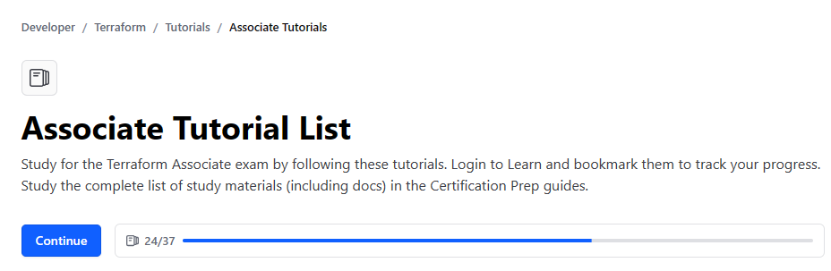

   
	
	
	
  

		<em>Developed with the tools below.</em>

	

I am currently studying for Terraform Associate certification. I created this repository as a study aid and keep track of my progress. 

Currently, I completed xxx out of 37 modules.

The exam guide is mostly based on AWS, so I tried exta modules below to get a better understanding of Terraform flexibility and practice its functionality. Some of the extra modules studied were a way to troubleshooting the study material.

# Extra modules (different shells, providers, etc)

## Azure with Windows PowerShell CLI
- setting up and testing the environment with NGINX server deployment 
- modifying infrastructure
- passing persistent or temporary variables
- defining outputs
- migrating states to Terraform Cloud

## Docker with WSL Ubuntu CLI

- creating conda environment
- setting up and testing Docker environment 
- adding variables
- adding outputs

## Amazon Web Services with Ubuntu CLI
 - code for initialising a docker NGINX engine
 - code for initialising an instance on Amazon Web Services 
 - code for changing Ubuntu image in the infrastructure 
 - code for defining outputs
 - code for defining variables
 - code for remote state configuration in Terraform Cloud Workspace 