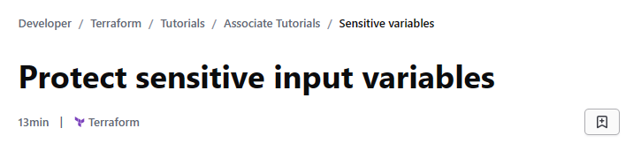

We will use Terraform to deploy a web application on AWS, including a VPC, load balancer, EC2 instances, and a database. 

We will replace the database's hard-coded credentials with variables configured with the sensitive flag. We will set values for variables using environment variables and with a .tfvars file. Finally, we will identify the sensitive values in state, and learn about ways to protect the state file.

## Refactor database credentials
In the main.tf the database username and password are hard-coded. We will refactor this configuration to remove these values. 


First, we declare input variables as sensitive for the database administrator username and password in variables.tf. 


Then, we update main.tf to reference these variables.


We can use two different methods to set the sensitive variable values.

*** 1. Set values with a .tfvars file ***
We create a new file called secret.tfvars to assign values to the new variables.
```hcl
db_username = "admin"
db_password = "insecurepassword"
```
We apply these changes using the `-var-file` parameter. 
```hcl
$ terraform apply -var-file="secret.tfvars"
```

We get an error:


After trial and error, we can settle on instance type db.m5.large and it worked! 


Terraform redacts the values of sensitive varibales from its output when its run a plan, apply, or destroy command. Notice that the password is marked sensitive value, while the username is marked sensitive. The AWS provider considers the password argument for any database instance as sensitive, whether or not it is declared the variable as sensitive, and will redact it as a sensitive value. 

Setting values with a .tfvars file separates sensitive values from the rest of variable values, and makes it clear to people working with the configuration which values are sensitive. We must also be careful not to check .tfvars files with sensitive values into version control. For this reason, GitHub's recommended .gitignore file for Terraform configuration is configured to ignore files matching the pattern *.tfvars.

*** 2. Set values with variables ***
Set the database administrator username and password using environment variables for Terraform Community Edition or Terraform variables for HCP Terraform.

HCP Terraform provides secure variable management by encrypting all variable values and allowing to mark them as sensitive during creation. This makes the variable a write-only and prevents all users from viewing its value in the HCP Terraform UI or reading it through the Variables API endpoint. Users with permission to read and write variables can set new values for sensitive variables.

We create the below input variables. Mark them as 'sensitive' by clicking the Sensitive checkbox.
```hcl
db_username	admin
db_password	adifferentpassword
```
Now, run terraform apply, and Terraform will assign these values to your new variables.

## Reference sensitive variables
When we use sensitive variables in your Terraform configuration, we can use them as you would any other variable. Terraform will redact these values in command output and log files, and raise an error when it detects that they will be exposed in other ways.

If we apply this change, Terraform will raise an error, since the output is derived from sensitive variables.

Flag the database connection string output as sensitive, causing Terraform to hide it.

Apply this change to see that Terraform will now redact the database connection string output. 

## Sensitive values in state
When we run Terraform commands with a local state file, Terraform stores the state as plain text, including variable values, even if they are flagged as sensitive. Terraform needs to store these values in the state so that it can tell if they have been changed them since the last time the configuration was applied.

```bash
$ grep "password" terraform.tfstate
```
